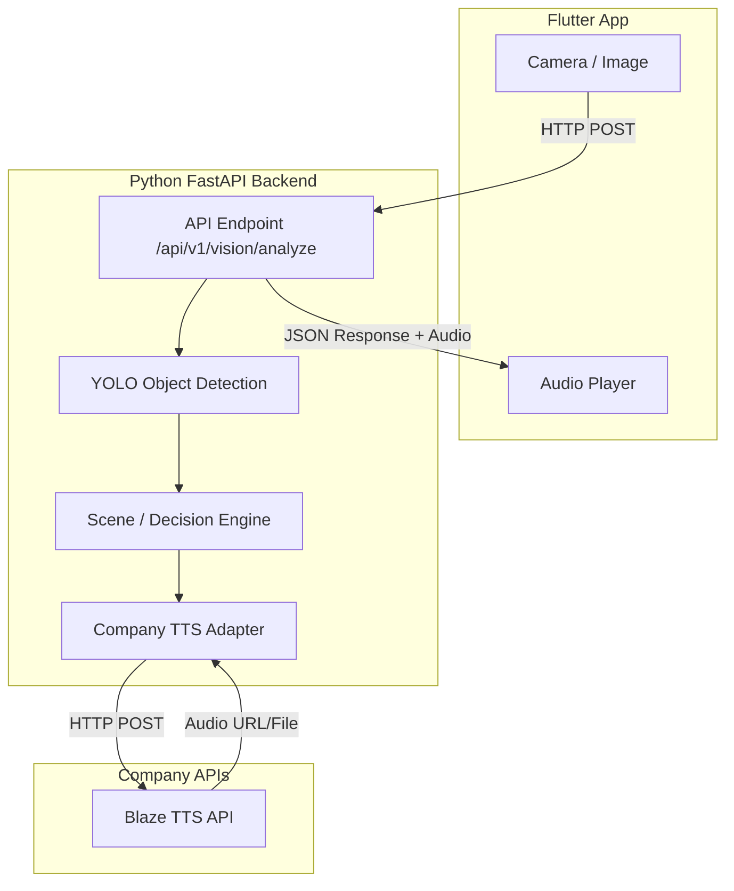

# 01 - KIẾN TRÚC HỆ THỐNG (SYSTEM ARCHITECTURE)

Đây là bản tóm tắt kiến trúc được rút ra từ `SYSTEM_ANALYSIS.md` để theo dõi nhanh khi code. Không sửa file này nếu không có thay đổi từ tài liệu gốc.

## Sơ đồ

## Các ràng buộc lõi (CODING RULES)
1. Backend tách biệt rõ ràng giữa YOLO và Decision Engine (YOLO không tự tạo câu nói).
2. Không hard-code API Key của doanh nghiệp.
3. Không tự ý train model từ đầu cho MVP, dùng pretrained YOLO (ví dụ `yolov8n`).
4. Giao diện (App) không được xử lý logic tạo câu nói, chỉ nhận kết quả và phát âm thanh.
